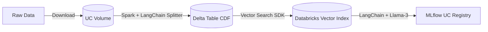
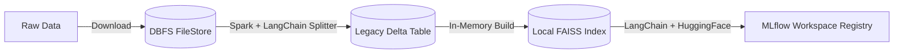

# Databricks Unity Catalog RAG Application

This repository contains a comprehensive, production-grade codebase for an end-to-end Retrieval-Augmented Generation (RAG) application on Azure Databricks.

It is designed to be compatible with both **Premium Tier** (Unity Catalog + Databricks Vector Search + Serverless Models) and **Free Tier / Community Edition** (DBFS + FAISS + HuggingFace).

## Architecture

### Premium Tier (Unity Catalog)


### Free Tier (Community Edition)


## Prerequisites

1.  **Azure Databricks Workspace**: Premium tier with Unity Catalog, OR Free/Community Edition.
2.  **Configuration Flag**: Inside each script in the `notebooks/` directory, set the `IS_PREMIUM_TIER` flag to `True` or `False` depending on your workspace type.
3.  **Libraries**: Install the package directly in your notebook environment using `uv`. The notebooks are already configured with the necessary magic commands:
    ```python
    # MAGIC %pip install uv
    # MAGIC !uv pip install --system -e ..
    ```

## Setup & Execution

Run the scripts located in the `notebooks/` directory sequentially:

1.  **`notebooks/01_data_ingestion.py`**: Downloads raw data and saves to a UC Volume (Premium) or DBFS (Free). Processes it with PySpark and saves to Delta.
2.  **`notebooks/02_vector_index_provisioning.py`**: Provisions a Delta Sync Index backed by your UC Delta table (Premium only). Automatically skips on Free Tier.
3.  **`notebooks/03_mlflow_rag_chain.py`**: Defines the LangChain RAG pipeline (connecting to Databricks Vector Search or building a local FAISS index), tests it, and logs the model to MLflow (UC Registry or Workspace Registry).
